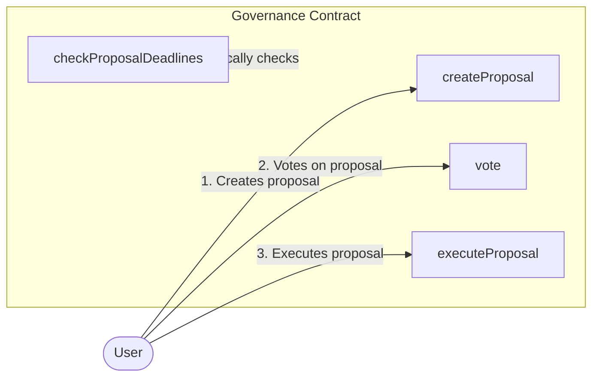

# Automated Governance Contract


## Overview

The Governance smart contract is a decentralized governance system that allows users to create proposals, vote on them, and execute or reject them based on the voting outcome. This contract is designed to facilitate community-driven decision-making in a transparent and efficient manner.

### Key Features:

1. **Proposal Creation**: Users can create proposals with descriptions.
2. **Voting**: Users can vote for or against proposals.
3. **Proposal Execution**: Proposals can be executed if they receive more votes in favor than against.
4. **Deadline Management**: Proposals have deadlines, and the contract automatically checks for expired proposals.
5. **Event Emission**: The contract emits various events to track proposal lifecycle and voting activities.

## Workflow




## Origin Contract

The Origin Contract is the main governance contract deployed on the primary chain. It manages proposals, voting, and execution processes.

### Key Features:

1. **Proposal Management**: Create, vote on, and execute proposals.
2. **Automatic Deadline Checking**: Every interaction with the contract triggers a check for proposal deadlines.
3. **Event Emission**: Emits events for proposal lifecycle stages and voting thresholds.

### Core Functions:

1. `createProposal(string memory description)`: Creates a new proposal.
2. `vote(uint256 proposalId, bool support)`: Allows users to vote on a proposal.
3. `executeProposal(address sender, uint256 proposalId)`: Executes a proposal if conditions are met.
4. `DeleteProposal(address sender, uint256 proposalId)`: Deletes a proposal (typically when against votes threshold is reached).
5. `checkProposalDeadlines()`: Checks if any proposal's deadline has been reached.

### Key Events:

1. `ProposalDeadlineReached(uint256 indexed id, uint256 deadline)`: Emitted when a proposal's deadline is reached.
2. `ProposalForThresholdReached(uint256 indexed id)`: Emitted when a proposal's "for" votes reach the threshold.
3. `ProposalAgainstThresholdReached(uint256 indexed id)`: Emitted when a proposal's "against" votes reach the threshold.

### Workflow:

1. When any function is called (create proposal, vote, execute proposal), it triggers `checkProposalDeadlines()`.
2. If a proposal's deadline is reached, the contract emits `ProposalDeadlineReached`.
3. If a proposal's "for" votes reach the threshold, it emits `ProposalForThresholdReached`.
4. If a proposal's "against" votes reach the threshold, it emits `ProposalAgainstThresholdReached`.

These events are listened to by the Reactive Contract to trigger appropriate actions.

## Reactive Contract

The Reactive Contract is deployed on a separate chain and listens for events from the Origin Contract to trigger actions.

### Key Features:

1. **Event Listening**: Monitors events from the Origin Contract.
2. **Automated Execution**: Triggers execution or deletion of proposals based on events.

### Core Functions:

1. `reactToDeadlineReached(uint256 proposalId)`: Called when `ProposalDeadlineReached` event is detected.
2. `reactToForThresholdReached(uint256 proposalId)`: Called when `ProposalForThresholdReached` event is detected.
3. `reactToAgainstThresholdReached(uint256 proposalId)`: Called when `ProposalAgainstThresholdReached` event is detected.

### Workflow:

1. Listens for events from the Origin Contract.
2. When `ProposalDeadlineReached` is detected, calls `executeProposal` on the Origin Contract.
3. When `ProposalForThresholdReached` is detected, calls `executeProposal` on the Origin Contract.
4. When `ProposalAgainstThresholdReached` is detected, calls `DeleteProposal` on the Origin Contract.

This setup allows for automated and timely execution or deletion of proposals based on voting outcomes and deadlines, bridging actions between two separate blockchain networks.


## Set up environment
To deploy and test the contracts, follow these steps. Ensure the following environment variables are configured appropriately:

* `SEPOLIA_RPC`
* `SEPOLIA_PRIVATE_KEY`
* `REACTIVE_RPC`
* `REACTIVE_PRIVATE_KEY`
* `SYSTEM_CONTRACT_ADDR`

You can use the recommended Sepolia RPC URL: `https://rpc2.sepolia.org`.


## Deployment and Interaction Steps

### Step 1: Deploy Governance contract on Sepolia
- Deploy the Governance contract
```sh
forge create --rpc-url $SEPOLIA_RPC --private-key $SEPOLIA_PRIVATE_KEY src/Autonomated_Governance/Governance.sol:Governance
```
- Save The returned address in `O_ORIGIN_ADDR`
- Transaction hash: 0x2d1972a928ca10c4e57b53b3bf54537507596ebd14880ad14a4fd6f69e817bf3


### Step 2: Deploy ReGovReactive contract on Reactive Network
- Deploy the ReGovReactive contract, passing in the Subscription Service address and the Governance contract address
```sh
forge create --rpc-url $REACTIVE_RPC --private-key $REACTIVE_PRIVATE_KEY src/Autonomated_Governance/ReGovReactive.sol:ReGovReactive --constructor-args $SYSTEM_CONTRACT_ADDR $O_ORIGIN_ADDR

```
- Transaction hash: 0x438b0cb20a5a1ca667cb3306e7182d85b838007441ca6631ecc289cd414dfdb7

### Step 3: Create a proposal
- Call createProposal function on the Governance contract
```sh
cast send $O_ORIGIN_ADDR "createProposal(string memory)" task1 --rpc-url $SEPOLIA_RPC --private-key $SEPOLIA_PRIVATE_KEY
```
- Transaction hash: 0x117dac036ee98bfaa2774d21e86f404368b903500f5649c5218bdd0fb780139a
- This creates a new proposal with a 5-minute deadline

### Step 4: Vote on the proposal
- Multiple users call the vote function to vote on the proposal
```sh
cast send $O_ORIGIN_ADDR "vote(uint256,bool)" 1 true --rpc-url $SEPOLIA_RPC --private-key $SEPOLIA_PRIVATE_KEY
```
- Transaction hashes: 0xe811760345e4c9978c30f532dde0eae4dd8b6425d27c35e5d893ec57840a3808

### Step 5: Proposal Resolution

#### 5a: Proposal reaches "For" threshold
- If the proposal reaches the "For" threshold (100 votes):
  - This emits a ProposalForThresholdReached event
  - The Reactive contract detects this event and calls executeProposal
  - Transaction hash: 0x7b61f09dba0446d8179da7e56ddeb33d7a08819830e2333988a4c28ef86caf1f

#### 5b: Proposal reaches "Against" threshold
- If the proposal reaches the "Against" threshold (100 votes):
  - This emits a ProposalAgainstThresholdReached event
  - The Reactive contract detects this event and calls DeleteProposal
  - Transaction hash: 0x15997fcb17465bfc009ba87109650200ea9e40866893e32c2b4e1f800bea9869

#### 5c: Proposal deadline reached
- If neither threshold is reached before the deadline:
  - The checkProposalDeadlines function emits a ProposalDeadlineReached event
  - The Reactive contract detects this event and calls executeProposal
  - Transaction hash: 0xa51296efe1861a799d7a778915bf60f698bc0ca7321de57e471ff68abcee6f11


