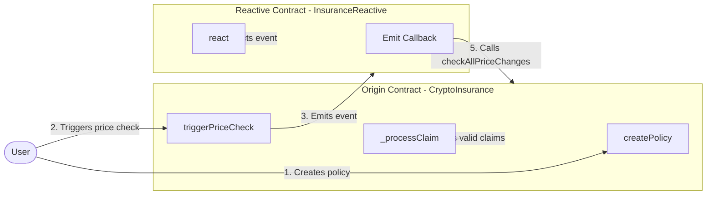

# Automated Crypto Insurance System

## Overview

The Automated Crypto Insurance System consists of two main contracts: CryptoInsurance (the Origin Contract) and InsuranceReactive (the Reactive Contract) and one helping contract of ERC20. This system provides decentralized insurance for cryptocurrency assets, allowing users to create policies, file claims, and receive payouts based on price fluctuations Automatically thorough reactive networks.

### Key Features:

1. **Multiple Insurance Types**: Supports loan, threshold, and sudden drop insurance policies.
2. **Automated Price Checking**: Uses Chainlink price feeds to monitor asset prices.
3. **Claim Processing**: Automatically processes claims when conditions are met.
4. **Meme Coin Rewards**: Distributes meme coins to users who trigger price checks.


## Workflow



## Origin Contract (CryptoInsurance)

The CryptoInsurance contract is the main insurance contract deployed on the primary chain. It manages policy creation, price checking, and claim processing.

### Key Features:

1. **Policy Management**: Create and manage different types of insurance policies.
2. **Price Monitoring**: Use Chainlink price feeds to track asset prices.
3. **Automated Claim Processing**: Process claims when conditions are met.
4. **Meme Coin Rewards**: Distribute meme coins for triggering price checks.

### Core Functions:

1. `createPolicy(address asset, InsuranceType insuranceType, uint256 coverageAmount, uint256 triggerPrice)`: Creates a new insurance policy.
2. `triggerPriceCheck()`: Allows users to trigger a price check and earn meme coin rewards.
3. `checkAllPriceChanges(address sender)`: Checks price changes for all supported assets.
4. `_processClaim(address asset, address holder, InsuranceType insuranceType)`: Processes a valid claim.

### Key Events:

1. `PolicyCreated(address indexed holder, address indexed asset, InsuranceType insuranceType, uint256 coverageAmount)`: Emitted when a new policy is created.
2. `ClaimFiled(address indexed holder, address indexed asset, InsuranceType insuranceType, uint256 amount)`: Emitted when a claim is filed.
3. `PriceChanged(address indexed asset, uint256 oldPrice, uint256 newPrice)`: Emitted when an asset's price changes.
4. `TriggerPriceCheck()`: Emitted when a price check is triggered.

## Reactive Contract (InsuranceReactive)

The InsuranceReactive contract is deployed on a separate chain and listens for events from the Origin Contract to trigger automated price checks.

### Key Features:

1. **Event Listening**: Monitors TriggerPriceCheck events from the Origin Contract.
2. **Automated Price Checks**: Triggers price checks on the Origin Contract based on events.

### Core Functions:

1. `react(uint256 chain_id, address _contract, uint256 topic_0, ...)`: Called when a TriggerPriceCheck event is detected.

### Workflow:

1. Listens for TriggerPriceCheck events from the Origin Contract.
2. When detected, emits a Callback event to trigger checkAllPriceChanges on the Origin Contract, Which eventually lead to process the claims if there conditions met.

This setup allows for automated and timely price checks across different blockchain networks, ensuring that the insurance system remains up-to-date with current asset prices.


## Set up environment
To deploy and test the contracts, follow these steps. Ensure the following environment variables are configured appropriately:

* `SEPOLIA_RPC`
* `SEPOLIA_PRIVATE_KEY`
* `REACTIVE_RPC`
* `REACTIVE_PRIVATE_KEY`
* `SYSTEM_CONTRACT_ADDR`

You can use the recommended Sepolia RPC URL: `https://rpc2.sepolia.org`.


## Detailed Workflow: CryptoInsurance with Reactive Integration

## 0. Deploy ERC20 Contract

### 0.1 Deploy The ERC20 Contract
 ```sh
forge create --rpc-url $SEPOLIA_RPC --private-key $SEPOLIA_PRIVATE_KEY src/CryptoInsurance.sol:CryptoInsurance
```
- Txn Hash : 0x7babf049edbd7720fae1c99541ccc1dcd499e37ecd1bc84613b3967e1a3a03f9
- Contract Address: 0xe750a67a0e74e390c1bd1461a8b9f525924c2c8b


## 1. Sepolia Testnet Deployment

### 1.1 Deploy CryptoInsurance Contract
- Deploy the CryptoInsurance contract
```sh
forge create --rpc-url $SEPOLIA_RPC --private-key $SEPOLIA_PRIVATE_KEY src/CryptoInsurance.sol:CryptoInsurance
```
* Save the returned address in `INSURANCE_CONTRACT_ADDR`
* Transaction hash: 0xaa19a045d03f40c659621aabf6f45347864e332c5e3e77a3875fba0d8a47be5c

* Deployed Address: 0xa186fdba77b131ef5b8072a44693d0db4d50ea71

### 1.2 Setup Admin Role(while deploying)
- Function: _grantRole(DEFAULT_ADMIN_ROLE, adminAddress)
- Function: _grantRole(ADMIN_ROLE, adminAddress)

### 1.3 Run approve and Transfer ERC20 To This Contract
- Approve Txn Hash : 0xa20d8668b8a046d91ae5181857f3f82616a1fca062c9c37c82b3de457c91a58b
- Transfer Txn Hash : 0x636922d200dcbe3fd88443b55f4d52f5f4f44d49eae44148846df485b9ecf10b

### 1.4 Set MemeCoin in Origin Contract
- function setMemeCoin(_memeCoinAddress,_memeCoinsPerCheck)
- Txn Hash:0x32a83f2ef525e9233a1579e9f250ed547f6cf3006a2f67fda38ed41759172962

## 2. Asset Configuration

### 2.1 Add Supported Assets
- Function: addSupportedAsset(address asset, address priceFeed, uint256 maxCoverage)
```sh
cast send $INSURANCE_CONTRACT_ADDR "addSupportedAsset(address,address,uint256)" $ASSET_ADDRESS $PRICE_FEED_ADDRESS $MAX_COVERAGE --rpc-url $SEPOLIA_RPC --private-key $SEPOLIA_PRIVATE_KEY
```
-  Transaction Hash: 0x88fa186e4a17f9a283625ba45f29841f29b3d78b4af874542d246eabdf256a83

## 3. Reactive Testnet Setup

### 3.1 Deploy InsuranceReactive Contract
- Function: constructor(address service_address, address _l1)
```sh
forge create --rpc-url $REACTIVE_RPC --private-key $REACTIVE_PRIVATE_KEY src/Insurance_payouts/InsuranceReactive.sol:InsuranceReactive --constructor-args $SYSTEM_CONTRACT_ADDR $INSURANCE_CONTRACT_ADDR

```
- Transaction Hash: 0x0dd408a449860c3e6ba54180692d40a6909b315b037a53ab33a0ed2dde0292f3
- Deployed Address: 0xa7Db05b4cf4c55cc9A9835935Fb2b86e4a2c99FB

### 3.2 Subscription to Events
- Function: subscribe(uint256,address,uint256,uint256,uint256,uint256)
- Automatically subscribed on deployment

## 4. User Interactions

### 4.1 Create Insurance Policies
- Call createPolicy function on the CryptoInsurance contract

```sh
cast send $INSURANCE_CONTRACT_ADDR "createPolicy(address,uint8,uint256,uint256)" $ASSET_ADDRESS 0 $COVERAGE_AMOUNT $TRIGGER_PRICE --value $PREMIUM_AMOUNT --rpc-url $SEPOLIA_RPC --private-key $SEPOLIA_PRIVATE_KEY --value 100000000000000000
```
- This creates a new insurance policy for the specified asset
- Txn Hash : 0xb67c443964a11dde2a5eee813478c6752d301434cd8b75790465223a62a6fee5

#### 4.1.1 Loan Insurance
- Function: createPolicy(address asset, InsuranceType.LOAN, uint256 coverageAmount, uint256 triggerPrice)


#### 4.1.2 Threshold Insurance
- Function: createPolicy(address asset, InsuranceType.THRESHOLD, uint256 coverageAmount, uint256 triggerPrice)


#### 4.1.3 Sudden Drop Insurance
- Function: createPolicy(address asset, InsuranceType.SUDDEN_DROP, uint256 coverageAmount, uint256 dropPercentage)


## 5. Price Monitoring and Claims

### 5.1 Manual Price Check Trigger
- Function: triggerPriceCheck()
- Call triggerPriceCheck function on the CryptoInsurance contract
```sh
cast send $INSURANCE_CONTRACT_ADDR "triggerPriceCheck()" --rpc-url $SEPOLIA_RPC --private-key $SEPOLIA_PRIVATE_KEY
```
- This emits a TriggerPriceCheck event
- Transaction hash(For the function) : 0x6c58c6de3e4d8840a98f53c12533629dba26f3a93ebf08076b05fd63bcdf35db
- Reactive Txn Hash to listen for this event : 0x4c04f133fc81698ab0208482820e22175d118ccaaa4470159a4425aff25b39bd  

### 5.2 Automated Price Checking
- Function: checkAllPriceChanges(address)
- Transaction Hash(By reactive smart contract): 0xbf37e3a221c0fd0d1746daf3c821e1683cdafe60333db78b91ffc76f54e28652

### 5.3 Claim Processing
- Internal Function: _processClaim(address asset, address holder, InsuranceType insuranceType, uint256 payoutAmount)
- If condition of any policy claims met.
-Txn Hash : 0xec00eab6b633b3d37361bfe98e01a3c3ccac9647183376417b94bb392495448c 

## 6. Policy Management

### 6.1 Withdraw Expired Policy
- Function: withdrawExpiredPolicy(address asset, InsuranceType insuranceType)
- User A Withdrawal Transaction Hash: 0x12111af078a589ff9072fdcffbdd44140c91fd5bbec41d206f65d1e0638723c9

### 6.2 Update Highest Price
- Function: updateHighestPrice(address asset)
- Transaction Hash: 0x1234567890123456789012345678901234567890


## 7. Admin Functions

### 7.1 Pause New Policies
- Function: pauseNewPolicies()
- Transaction Hash: 0x000f412d9bbd518741be6fee48a62f2da2797b49a4c4e09fabd601846bdfe10d

### 7.2 Unpause New Policies
- Function: unpauseNewPolicies()
- Transaction Hash: 0x6fa3b6d66499b843c3bb6f7392fe079b78c9c5f31689399c7857d11ab68ea53d

### 7.3 Emergency Withdraw
- Function: emergencyWithdraw()
- Transaction Hash: 0x4f763f56b740eb0f8f991f1a87b370a2e4e81e2a312f816d6b4b444a0f8e1850

## 8. User Reward Claims

### 8.1 Claim Meme Rewards
- Call claimMemeReward function on the CryptoInsurance contract
```sh
cast send $INSURANCE_CONTRACT_ADDR "claimMemeReward()" --rpc-url $SEPOLIA_RPC --private-key $SEPOLIA_PRIVATE_KEY
```
- This claims any accumulated meme coin rewards for the caller
- Transaction hash: 0xe73ba0e1fbe0a14944dd960db48fb909613c81794914d66611f8c14a156945a3

## 9. Contract Monitoring

### 9.1 Check Total Coverage
- Function: getTotalCoverage()

### 9.2 Get User Policies
- Function: getUserPolicies(address user, address asset)

### 9.3 Get Active Policy Holders
- Function: getActiveHolders()


## Notes

- The "cross-chain" functionality is emulated using the Sepolia testnet for both Origin (CryptoInsurance) and Destination contracts, with communication facilitated through the Reactive Smart Contract.
- All interactions with the Reactive network are automatic and don't produce traditional transaction hashes.


