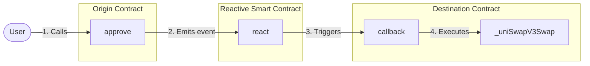

# Automated One-Step Swap on the Reactive Network

## Contact
**Kenneth Scott Smith**
- Email: 
  - ksmit323@gmail.com
- Github: 
  - [github.com/ksmit323](https://github.com/ksmit323)
- Personal website: 
  - [ksmit323.github.io](https://ksmit323.github.io/)
- Telegram: 
  - @ksmit323

This [job posting](https://cryptocurrencyjobs.co/engineering/reactive-network-smart-contract-developer-bounty-campaign/) says to mention my interest in job opportunities.  Consider me interested :).  Feel free to reach out!


## Problem Statement
When swapping tokens on a typical DEX, users normally have to go through a two-step process:
1. Approve the swap
2. Execute the swap

With the Reactive network and Reactive Smart Contracts (RSC), we can reduce this to a one-step process:
1. Approve the swap

The problem is approving can be a HUGE pain, especially when you swap a lot.  Which means you will probably give "unlimited" approval to DEX's and INSERT HACK HERE. Boom, all of your funds are drained. 

The neat thing would be to only approve what you want to trade.  The neat thing is that is exactly what this demonstration does.  You ONLY approve what you trade and then the approval AUTOMATICALLY gets set back to zero.  Its cooler than getting rekt. 

## Approaches

There are two approaches this repository takes to one-step swap, ***both ways use Reactive network and RSC's***:
1. Without IERC20 Permit
2. With IERC20 Permit

The main focus of this repo is ***Without the IERC20 Permit***.

To see the **With IERC20 Permit** implementation, please go to the ```/SwapWithPermit``` directory and start with the README.md file there:

- [One Step Swap with IERC20 Permit](../automated-one-step-swap/SwapWithPermit/README.MD)


## Overview
The user kicks things off by calling the `approve()` function for the ERC-20 token they want to **sell**.  From there the Reactive contract will pick up the emitted event and take care of the rest.

There are three main contracts involved:

* Origin chain contract 
    - ERC-20 token contract already deployed on Sepolia
* Reactive chain contract     
    - Deployed on Reactive network
* Destination chain contract 
    - Deployed on Sepolia

A general work flow diagram goes like this:



>*The goal is to complete the whole swap process with just one function call*

## Origin Contract
This is the ERC-20 contract for the ERC-20 token the user wants to **sell**.  All the user has to do is call the `approve()` function to approve the Destination contract to spend their tokens. Once the user does that, they are **done**.

For this demonstration, we use the [WETH9](https://sepolia.etherscan.io/address/0xfFf9976782d46CC05630D1f6eBAb18b2324d6B14) and [USDT](https://sepolia.etherscan.io/address/0xaA8E23Fb1079EA71e0a56F48a2aA51851D8433D0) ERC-20 contracts already deployed on Sepolia testnet.

>The origin contract is the same as the `TOKEN_IN_ADDRESS` in the enviroment variables as it is the token we put IN the swap router to sell.  More on environment variables later.

## Reactive Contract (RSC)
Once the user calls the `approve()` function in the Origin contract, that function emits an `Approve event`.  The RSC picks up on that event and calls the `callback()` function in the destination contract.

For this demonstration, the contract is implemented as `ReactiveContract.sol`

## Destination Contract
The destination contract starts by transferring the user's tokens to itself. Next, it approves the swap router to spend those tokens.  Finally, the contract executes the swap using `Uniswap V3` swap router. 

For this demonstration, the contract is implemented as ```DestinationContract.sol```

## Notes Before We Go Any Further:
1. We are using the Uniswap V3 Swap Router
2. This demonstration uses **WETH9** and **USDT** tokens deployed on Sepolia
3. You can exchange **SepoliaETH** for **WETH9** on [Uniswap's Sepolia Network](https://app.uniswap.org/swap?chain=sepolia).  
4. *Take care of the amount you enter*. USDT is is a token with 6 decimals and WETH with 18 decimals.  Therefore, your *values* for a single token are:
     - 1 USDT = 1,000,000
     - 1 WETH9 = 1,000,000,000,000,000,000
5. Finally, the steps below assume you have have cloned the repository and are familiar with using the terminal window

## Deployment & Testing

The steps to set up and deploy will be this:
1. Set up environment variables in the `.env` file
2. Deploy Destination contract
3. Deploy Reactive contract
4. If necessary, call the `setInputParameters` function in the destination contract to change the default parameters (spoiler alert, its not necessary here)
5. To test, call the `approve` function on the ERC20 contract for the token you want to **sell**

### Step 1
Add the appropriate keys, addresses and endpoints to these environment variables in the `.env` file. 

* `SEPOLIA_RPC`
* `SEPOLIA_PRIVATE_KEY`
* `REACTIVE_RPC`
* `REACTIVE_PRIVATE_KEY`
* `SYSTEM_CONTRACT_ADDR`
* `TOKEN_IN_ADDRESS` - the token you want to **sell**
* `TOKEN_OUT_ADDRESS` - the token you want to **buy**
* `AMOUNT_IN` - how much you want to sell

<br />

> The `.env.example` file already has some variables set up for you with default values and pre-deployed contracts.  After Step 1, you could technically skip to Step 5 and just test with those contracts.

### Step 2
- Deploy the `DestinationContract.sol` (destination chain contract) with this command:
    ```sh
    forge create --rpc-url $SEPOLIA_RPC --private-key $SEPOLIA_PRIVATE_KEY src/automated-one-step-swap/DestinationContract.sol:DestinationContract
    ```
* Assign the deployment address to the environment variable `DESTINATION_CONTRACT_ADDRESS` in the `.env` file.  
* Run `source .env` in your terminal window to reload environment variables.

<br />

> All commands will be called from the root directory.  If you are in another directory, switch to the root project folder and then run the command

### Step 3
* Deploy the `ReactiveContract.sol` (reactive chain contract), configuring it to callback to the `DESTINATION_CONTRACT_ADDRESS` with this command:
    ```sh
    forge create --rpc-url $REACTIVE_RPC --private-key $REACTIVE_PRIVATE_KEY src/automated-one-step-swap/ReactiveContract.sol:ReactiveContract --constructor-args $SYSTEM_CONTRACT_ADDR $DESTINATION_CONTRACT_ADDRESS
    ```

### Step 4
>For the purpose of this demonstration, skip this step and don't worry about changing the input parameters

When you deployed the `DestinationContract.sol` contract, the constructor automatically set default input parameters that will be needed for the `UniswapV3` swap router. These default input paramters are:
- `tokenOut` - the token to be swapped. The default is **USDT**.  For this demonstration we will swap **WETH9** for **USDT**
- `amountOutMin` - This is the minimum amount you would be willing to trade your token for a.k.a. *slippage*.  This prevents too much slippage. This also requires a proper oracle and is beyond the scope of this demonstrative purpose.  The default is set to zero but that would not be acceptable in production purposes. 
- `fee` - Fee for liquidity provider. The standard fee across liquidity pools on Uniswap is 0.03% so that's the default here.

If you want to change one or more input parameter, you can call this function:

```solidity
function setInputParameters(address _tokenOut, uint256 _amountOutMin, uint24 _fee)
``` 

Put `0` for any value you DON"T want to change.  For example, the below command will change the `_tokenOut` parameter to USDC but leave the other two parameters the same
 
```sh
cast send $DESTINATION_CONTRACT_ADDRESS "setInputParameters(address,uint256,uint256)" $USDC_TOKEN_ADDRESS 0 0 --rpc-url $SEPOLIA_RPC --private-key $SEPOLIA_PRIVATE_KEY
```

## Step 5
Now for the grand finale for all the WAGMI bros out there.  Test the whole set up by running the below command:

```sh
cast send $TOKEN_IN_ADDRESS "approve(address,uint256)" $DESTINATION_CONTRACT_ADDRESS $AMOUNT_IN --rpc-url $SEPOLIA_RPC --private-key $SEPOLIA_PRIVATE_KEY
```

This command will approve the `DestinationContract.sol` contract to swap the token you want to sell i.e. the `TOKEN_IN_ADDRESS`, which will initiate and complete the entire swap process.

Wait a few moments and check your wallet for your USDT.

HODL!

## Deployed Addresses & Transaction Hashes for each of the above steps 

### Step 1

No hashes necessary

### Step 2

Deploy `DestinationContract.sol` (on Sepolia chain):

```sh
Deployed Address: 0xA5D848b2EE949784096783Bb9E64467d1E63BD4D
TX hash: 0xdbbb77e2ac19d4eb892a27b06178fea240355892542189345fbc8432cd744fe6
```

### Step 3

Deploy `ReactiveContract.sol` (on Reactive chain):

```sh
Deployed Address: 0x8EDD778381252a8707b9ba7AF519Eb783E65E6fe
TX hash: 0xc26500fcefaca524a66a4974f3452274610bcf84d629e5093a3a27301231cfda
```

### Step 4

No hashes necessary

### Step 5
```sh
Approval TX hash: 0xa0aecc9003368585414662d747366de29c947e4a69daed3021847291ae957bec
WETH9 for USDT TX hash: 0xee1192a13f7d55894230b3b94b6e611d3493bdcd49e167cae3955c0fbb2adfc6
```


## TROUBLESHOOTING
- Don't forget you have to pay gas
    - Make sure you have SepoliaETH in your Sepolia address
    - Make sure you have REACT in your Reactive address

- Don't forget you need to have the appropriate ERC-20 token in your account on Sepolia to swap
    - This documentation assumes you have WETH9 in your wallet that you want to swap for USDT
    - You can get WETH9 from [Uniswap's Sepolia Network](https://app.uniswap.org/swap?chain=sepolia)

- Don't forget to load in your environment variables!
    - You may need to run the command ```source .env``` in your terminal
    - You may need to rerun the `source.env` command *every time* you change your environment variables

- If something is not working, check the events log on Sepolia Etherscan
    - See if the events are even being emitted. If not, the functions aren't being called
  
- Make darn sure you are calling the right contracts.  
    - The very first call should be to the ERC-20 token contract you want to **sell**

- Be very careful with the values you enter.  **WETH9** is submitted as **wei**
    - If you want to trade 0.01 WETH9, you need to enter a value with 16 zeros i.e. 10000000000000000

- Remember, the `TOKEN_IN_ADDRESS` parameter is the token you want to ***sell***

## Acknowledgements
Thank you to the Reactive team for a cool network! Thank you `Ivan` for promptly responding in Telegram! 

## Improvements
Given more time, I would have added tests and more access controls. Also, the RSC contract picks up on every `approve` event.  There's definitely a way to make this more efficient to only pick up on events we're interested in. For example, the `transferFrom` function emits an `approve` event that the RSC picks up but doesn't need to. 