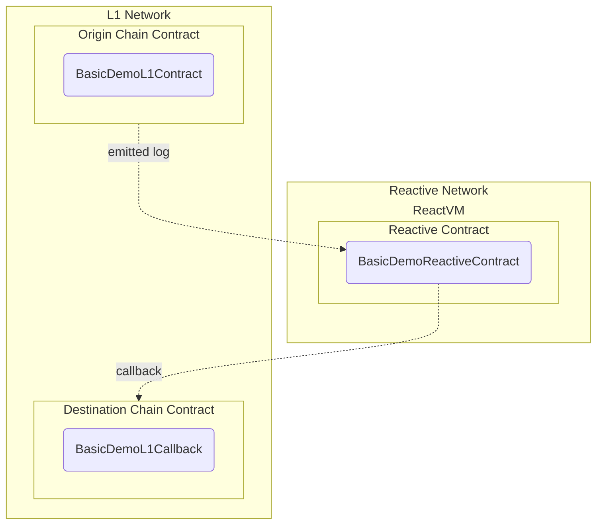

## Swap with IERC20 Permit

### Set up environment

- You will need some ERC-20 tokens on Sepolia if not using USDT and/or WETH9
- Make sure you have ```node``` installed

for With Permit script:
```bash
npm install dotenv ethers 
```
### Set environment varibles 
You will need to set the below environment variables to run the ```SwapWithPermit.js``` file:

#### Set your Sepolia RPC and private key
```
SEPOLIA_RPC=
SEPOLIA_PRIVATE_KEY=
```
#### Set your amounts. Feel free to use your own 
```
AMOUNT_IN="10000000" // 10 USDT
AMOUNT_OUT_MIN="0" // naively set to zero for testing purposes; in production you would have to get an oracle
FEE="3000" // standard fee of 0.3%
```
#### L1 Contract Address - Feel free to deploy your own 
```
ORIGIN_WITH_PERMIT_ADDRESS="0x9c560743681C0DCf973faa57273E5f5a6133B882"
```
#### Token Address-- Feel free to set your own
```
TOKEN_IN_ADDRESS="0xaA8E23Fb1079EA71e0a56F48a2aA51851D8433D0"   // USDT
TOKEN_OUT_ADDRESS="0xfFf9976782d46CC05630D1f6eBAb18b2324d6B14"  // WETH9
```

From root directory cd and run
```bash
cd src/automated-one-step-swap/SwapWithPermit/script
node SwapWithPermit.js
```

- generate v, r, s offchain
- sign tx on chain
- run Origin contract, it calls RSC, it calls callback on Origin

### WORKFLOW

User calls approveSwap() function in Origin contract -> Origin contract approves and transfers user's tokens to itself -> Origin emits SwapApproved event -> This emitted event triggers RSC react() -> react() triggers callback() to the Origin -> callback() triggers Uniswap Swap router which makes the swap

