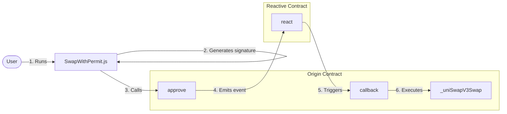

# Automated One-Step Swap with IERC20 Permit

This approach uses the IERC20 Permit functionality to perform the one-step swap.  The work flow and design are quite different than the other implementation in the `/automated-one-step-swap` directory.

> WETH9 does NOT support IERC20 Permit so in this implementation, we will swap USDT for WETH9 as opposed to the other way around in the other implementation

## Overview
The user kicks things off by running the `SwapWithPermit.js`.  From there, the script will perform an off-chain function to generate a signature from the user's private key.  This signature will be used to sign a transaction. Next, the `SwapWithPermit.js` script runs the `OriginContractWithPermit.sol` contract to approve spending and transfer the user's tokens to itself.  This emits a `Approval event`.  The Reactive Contract (RSC) picks up on that event and triggers the `_uniSwapV3Swap` function back in the Origin contract that performs the swap on using the `UniswapV3` swap router. 

There are two main contracts involved with this implementation:

* Origin chain contract
    - deployed on Sepolia
* Reactive chain contract
    - deployed on Reactive chain

A general work flow diagram goes like this:



>Along with the off-chain function, the user only has to approve the Origin contract as the spender and the RSC takes care of the rest

## Origin Contract
The user generates a signature with an off-chain function that is sent to this contract.  The contract will then approve itself as the spender, transfer tokens to itself from the user and then emit the `Approval event`.  The contract then awaits for the RSC to trigger the `callback()` function.

For this demonstration, the contract is implemented as ```OriginWithPermitContract.sol```

## Reactive Contract
Once the `Approve event` is emitted from the Origin contract, the RSC picks up on that event and calls the `callback()` function *back to the Origin contract*.

For this demonstration, the contract is implemented as `ReactiveWithPermitContract.sol`

## Notes Before We Go Any Further:

! **WETH9 does NOT support IERC20 Permit so we will sell USDT to buy WETH9 in this demonstration**

1. We are using the Uniswap V3 Swap Router
2. This demonstration uses **WETH9** and **USDT** tokens deployed on Sepolia
3. You can exchange **SepoliaETH** for **WETH9** on [Uniswap's Sepolia Network](https://app.uniswap.org/swap?chain=sepolia).  
4. *Take care of the amount you enter*. USDT is is a token with 6 decimals and WETH with 18 decimals.  Therefore, your *values* for a single token are:
     - 1 USDT = 1,000,000
     - 1 WETH9 = 1,000,000,000,000,000,000
5. Finally, the steps below assume you have have cloned the repository and are familiar with using the terminal window

## Set up environment
- Make sure you have ```node``` installed
- Install the required dependencies:
    ```bash
    npm install dotenv ethers 
    ```

## Deployment & Testing

The steps to set up and deploy will be this:
1. Set up environment variables in the `.env` file
2. Deploy Origin contract
3. Deploy Reactive contract
4. To test, call the `SwapWithPermit.js` script

### Step 1
Add the appropriate keys, addresses and endpoints to these environment variables in the `.env` file. 

* `SEPOLIA_RPC`
* `SEPOLIA_PRIVATE_KEY`
* `REACTIVE_RPC`
* `REACTIVE_PRIVATE_KEY`
* `SYSTEM_CONTRACT_ADDR`
* `TOKEN_IN_WITH_PERMIT_ADDRESS` - the token you want to **sell**
* `TOKEN_OUT_WITH_PERMIT_ADDRESS` - the token you want to **buy**
* `AMOUNT_IN` - how much you want to sell

<br />

> If you have already run the first implementation in the `/automated-one-step-swap` directory, then you should already have these variables set up.

> The `.env.example` file already has some variables set up for you with default values and pre-deployed contracts.  After Step 1, you could technically skip to Step 4 and just run the `SwapWithPermit.js` file to test. 

### Step 2
- Deploy the `OriginWithPermitContract.sol` (origin chain contract) with this command:
    
    ```sh
    forge create --rpc-url $SEPOLIA_RPC --private-key $SEPOLIA_PRIVATE_KEY src/automated-one-step-swap/SwapWithPermit/src/OriginWithPermitContract.sol:OriginWithPermitContract
    ```
* Assign the deployment address to the environment variable `ORIGIN_WITH_PERMIT_CONTRACT_ADDRESS` in the `.env` file.  
* Run `source .env` in your terminal window to reload environment variables.

<br />

> All commands will be called from the root directory.  If you are in another directory, switch to the root project folder and then run the command

### Step 3
* Deploy the `ReactiveWithPermitContract.sol` (reactive chain contract), configuring it to callback to the `ORIGIN_WITH_PERMIT_CONTRACT_ADDRESS` with this command:
    
    ```sh
    forge create --rpc-url $REACTIVE_RPC --private-key $REACTIVE_PRIVATE_KEY src/automated-one-step-swap/SwapWithPermit/src/ReactiveWithPermitContract.sol:ReactiveWithPermitContract --constructor-args $SYSTEM_CONTRACT_ADDR $ORIGIN_WITH_PERMIT_CONTRACT_ADDRESS
    ```

### Step 4

Now for the grand finale for all my WAGMI gals. From root directory, run the following commands:
```bash
cd src/automated-one-step-swap/SwapWithPermit/script
node SwapWithPermit.js
```
This script will:
- generate v, r, s signatures offchain
- call and sign the `approve` function from the Origin contract

The only on-chain transaction the user does is the initial `approve` function to the Origin contract. The rest is taken care of by the RSC.

Wait a few moments and check your wallet for your USDT.

## Deployed Addresses & Transaction Hashes for each of the above steps 

### Step 1

No hashes necessary

### Step 2

Deploy `OriginWithPermitContract.sol` (on Sepolia chain):

```sh
Deployed Address: 0x468670BE635a1ad50a5AF800cE6919B852264CC4
TX hash: 0xd0042956fa194f483d0010f8f433e492f9e56263da03c7932cfba142fbdd324a
```

### Step 3

Deploy `ReactiveWithPermitContract.sol` (on Reactive chain):

```sh
Deployed Address: 0x407B2DF9fF93B8914aFaFee8198f9D98C4c20971
TX hash: 0x699e4dafef0b6a8cb7128d642fe64e77726a0a2070911326c6983e0e0498a137
```

### Step 4

Run `SwapWithPermit.js`:

```sh
Approval TX hash: 0x9ceeed9aef64f2105105db61f1d362be1481703dc8a0506ed804c0cb661614e1
USDT for WETH9 TX hash: 0xe027eb1674db750f413b57601201475c30282c6f90eb39d5f72d4f2262b9d9f3
```

## TROUBLESHOOTING
- Javascript is a pain.  Make sure your dependencies are updated.
    - Ethers.js should be higher than version 6.0.0

- Don't forget you have to pay gas
    - Make sure you have SepoliaETH in your Sepolia address
    - Make sure you have REACT in your Reactive address

- Don't forget you need to have the appropriate ERC-20 token in your account on Sepolia to swap
    - This documentation assumes you have WETH9 in your wallet that you want to swap for USDT
    - You can get WETH9 from [Uniswap's Sepolia Network](https://app.uniswap.org/swap?chain=sepolia)

- Don't forget to load in your environment variables!
    - You may need to run the command ```source .env``` in your terminal
    - You may need to rerun the `source.env` command *every time* you change your environment variables

- If something is not working, check the events log on Sepolia Etherscan
    - See if the events are even being emitted. If not, the functions aren't being called

- Be very careful with the values you enter.  **WETH9** is submitted as **wei**
    - If you want to trade 0.01 WETH9, you need to enter a value with 16 zeros i.e. 10000000000000000

- Remember, the `TOKEN_IN_WITH_PERMIT_ADDRESS` parameter is the token you want to ***sell***

- WETH9 does NOT implement IERC20 Permit so you cannot sell it with this implementation

## Acknowledgements
Thank you to the Reactive team for a cool network! Thank you `Ivan` for promptly responding in Telegram! 