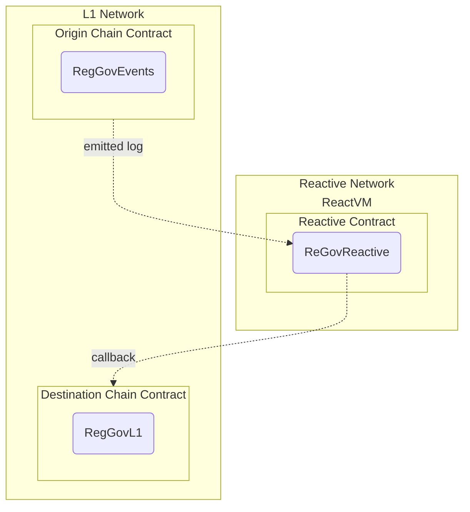

# Reactive Network Cross-Chain Governance

## Overview

Key concepts:

- Low-latency monitoring of governance request events emitted by arbitrary contracts in the L1 Network (Sepolia testnet in this case).
- Calls from Reactive Network to L1 Governance contracts.



In practical terms, this general use case can be applicable in any number of scenarios, from simple stop orders to fully decentralized algorithmic trading.

There are three main contracts involved in this scenario:

- Origin chain contract.
- Reactive contract.
- Destination chain contract.

### Origin Chain Contract

This contract, or set of contracts, presumably emits logs of interest to the Reactive Network user. In financial applications, this could be a DEX, such as a Uniswap pool, emitting data on trades and/or exchange rates. Typically, the contract is controlled by a third party; otherwise, mediation by Reactive Network would be unnecessary.

Here, this contract is implemented in ReGovEvents.sol. Its functionality is to send governance requests and emit the corresponding events. This could be called from any chain but requires the owner to have a share of the governance token on the destination chain.

## Reactive Contract

Reactive contracts implement the logic of event monitoring and initiating calls back to L1 chains. These contracts are fully-fledged EVM contracts with the ability to maintain state persistence, subscribe/unsubscribe to multiple event origins, and perform callbacks. This can be done both statically and dynamically by emitting specialized log records, which specify the parameters of a transaction to be submitted to the destination chain.

Reactive contracts are executed in a private subnet (ReactVM) tied to a specific deployer address. This limitation enhances their ability to scale, although it restricts their interaction with other reactive contracts.

In our demo, the reactive contract implemented in ReGovReactive.sol subscribes to governance events emitted by ReGovL1Contract.sol upon deployment. Whenever the observed contract reports a governance decision requiring execution, the reactive contract initiates an authorized L1 callback by emitting a log record with the necessary transaction parameters and payload to ensure proper execution on the destination network.

## Destination Chain Contract

The ReGovL1.sol is the L1 part of the governance logic. The governance contract listens to the voter authorized events and call the appropriate governance function on the destination network.  
For setting a proposal to accepted or rejected, we'll use a common approach based on the voting period and a quorum (minimum number of votes required for the proposal to be valid). We can add a deadline to each proposal, and only proposals that receive enough votes before the deadline will be considered valid.  
To add more dynamic business logic, we'll incorporate a base grant amount and a multiplier for the quorum. This will allow the quorum requirement to scale with the grant amount requested in the proposal.

## Deployment

### Prerequisites

Ensure you have the following environment variables set up:

```
export SEPOLIA_RPC="<YOUR_SEPOLIA_RPC_URL>"
export SEPOLIA_PRIVATE_KEY="<YOUR_SEPOLIA_PRIVATE_KEY>"
export REACTIVE_RPC="<YOUR_REACTIVE_RPC_URL>"
export REACTIVE_PRIVATE_KEY="<YOUR_REACTIVE_PRIVATE_KEY>"
export SYSTEM_CONTRACT_ADDR="<YOUR_SYSTEM_CONTRACT_ADDR>"
export GOVERNANCE_TOKEN_ADDRESS="<YOUR_GOVERNANCE_TOKEN_ADDRESS>"
```

### Deploy the Contracts

First, deploy the governance token contract to Sepolia:

```
forge create --rpc-url $SEPOLIA_RPC --private-key $SEPOLIA_PRIVATE_KEY src/demos/ReGov/GovernanceToken.sol:GovernanceToken --constructor-args 1000000000000000000
```

Grab the governance token address and put it in this environment variable: $GOVERNANCE_TOKEN_ADDRESS.

Next, deploy the origin chain contract to Sepolia:

```
forge create --rpc-url $SEPOLIA_RPC --private-key $SEPOLIA_PRIVATE_KEY src/demos/ReGov/ReGovEvents.sol:ReGovEvents
```

Assign the deployment address to the environment variable ORIGIN_ADDR.

Now deploy the governance contract to Sepolia (Here, the AUTHORIZED_CALLER_ADDRESS should contain the address you intend to authorize for performing callbacks or use 0x0000000000000000000000000000000000000000 to skip this check):
Other constructor-args should be set as follows:

- BASE_GRANT: The base grant used for calculating the base voting - requirement for a proposal to be accepted (uint256).
- QUORUM_MULTIPLIER: Used to adjust voting requirements based on the grant amount (uint256).
- VOTING_PERIOD: The allowed period for proposal voting (uint256).

```
forge create --rpc-url $SEPOLIA_RPC --private-key $SEPOLIA_PRIVATE_KEY src/demos/ReGov/ReGovL1.sol:ReGovL1 --constructor-args $GOVERNANCE_TOKEN_ADDRESS $AUTHORIZED_CALLER_ADDRESS $BASE_GRANT $QUORUM_MULTIPLIER $VOTING_PERIOD
```

Assign the deployment address to the environment variable `CALLBACK_ADDR`.

Finally, deploy the reactive contract, configuring it to send callbacks
to `CALLBACK_ADDR`.

```
forge create --rpc-url $REACTIVE_RPC --private-key $REACTIVE_PRIVATE_KEY src/demos/ReGov/ReGovReactive.sol:ReGovReactive --constructor-args $SYSTEM_CONTRACT_ADDR $CALLBACK_ADDR
```

## Testing the workflow

Test the whole setup by creating a proposal:

```
cast send $ORIGIN_ADDR 'requestProposalCreate(string,uint256)' --rpc-url $SEPOLIA_RPC --private-key $SEPOLIA_PRIVATE_KEY "Proposal 1" 5000000000000000 # sample tx(Sepolia Testnet): 0x27ba36ebd7619857c7d4aa421cdc8576d66c12f49d36b20c6849eb2ed9fa03b6
```

After a few moments, the ReactVM calls on the callback contract, and we will have a new proposal record:

```
cast call $CALLBACK_ADDR 'proposals(uint256)(uint256,address,string,uint256,uint256,uint256,bool,uint256,uint256)' --rpc-url $SEPOLIA_RPC --private-key $SEPOLIA_PRIVATE_KEY 1
```

Testing the react contract:

```
cast send 0x0063b71A346a4fDd5a7DbFa443eDBfcC09740Cd2 'react(uint256,address,uint256,uint256,uint256,uint256,bytes,uint256,uint256)' --rpc-url $REACTIVE_RPC --private-key $REACTIVE_PRIVATE_KEY 11155111 0xb0D0d3AEa47E1E50b41f69545937f97886e232a9  0x3199a34f29254e2f3052f39a547b89816d2e8c9f8b08c5c8ce5c60b5b6c43ca6 0xE5cc67FB6E343DaE671EB516f95DbfA1F2fb2D44 50000000000000000000 0x0000000000000000000000000000000000000000 0x50726f706f73616c2031 0x0000000000000000000000000000000000000000 0x0000000000000000000000000000000000000000 # sample tx(Kopli Testnet): 0x5d99c1bc65bcf2a3835a8e4dba45bd6e2f4391dbe63fb3c3964b3b8eff81a7ba
```

### Deployed contracts

#### GovernanceToken

Deployer: 0xE5cc67FB6E343DaE671EB516f95DbfA1F2fb2D44  
Deployed to: 0x95CBb0592C16B8BA79327E17D3A6B0953a449350  
Transaction hash: 0xaa94d9e497f7e1b571fcc961de7cea06eb73516db7b3b2c0d59405e8f62b5e2a

---

#### ReGovEvents

Deployer: 0xE5cc67FB6E343DaE671EB516f95DbfA1F2fb2D44  
Deployed to: 0xb0D0d3AEa47E1E50b41f69545937f97886e232a9  
Transaction hash: 0xf81a122da3866149459dde83dfc94523da8f6fcdfa48ba6b6a66493cd49b7e00

---

#### ReGovL1

Deployer: 0xE5cc67FB6E343DaE671EB516f95DbfA1F2fb2D44  
Deployed to: 0xc6F237C2ED2434aF698CeE205A2C158E9E118B77  
Transaction hash: 0xc6e08dc80d27c44ce2e7ac66066c91b9fb95f478c241585d6e4442a037d0fd80

---

#### ReGovReactive

Deployer: 0xE5cc67FB6E343DaE671EB516f95DbfA1F2fb2D44  
Deployed to: 0x8420Bd1209967d0DBe6c3cdF38dDCe077350Af08  
Transaction hash: 0xd3fd9b5fc886b9fcabfe0f57a81e31e853ea3914ef45b7bf9cf81ef6365b065d
