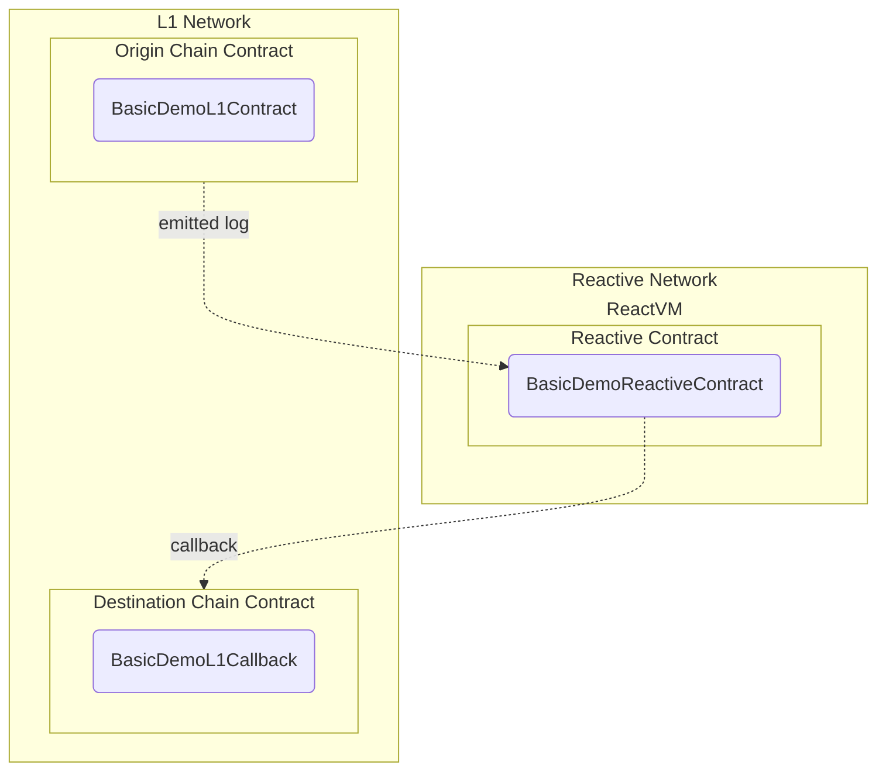

# Reactive Network Demo

## Overview

This demo simulates a basic use case of Reactive Network, employing two key capabilities:

* Low-latency monitoring of logs emitted by arbitrary contracts in L1 Network (Sepolia testnet in this case).
* Calls from Reactive Network to arbitrary L1 contracts.



In practical terms, this general use case can be applicable in any number of scenarios, from simple stop orders to fully decentralized algorithmic trading.

There are three main contracts involved in this scenario:

* Origin chain contract.
* Reactive contract.
* Destination chain contract.

### Origin Chain Contract

This contract, or set of contracts, presumably emits logs of interest to the Reactive Network user. In financial applications, this could be a DEX, such as a Uniswap pool, emitting data on trades and/or exchange rates. Typically, the contract is controlled by a third party; otherwise, mediation by Reactive Network would be unnecessary.

In our demo, this contract is implemented in `BasicDemoL1Contract.sol`. It is a straightforward contract that accepts native transfers, emits log records about them, and returns the funds to the sender.

### Reactive Contract

Reactive contracts implement the logic of event monitoring and initiating calls back to L1 chains. These contracts are fully-fledged EVM contracts with the ability to maintain state persistence, subscribe/unsubscribe to multiple event origins, and perform callbacks. This can be done both statically and dynamically by emitting specialized log records, which specify the parameters of a transaction to be submitted to the destination chain.

Reactive contracts are executed in a private subnet (ReactVM) tied to a specific deployer address. This limitation enhances their ability to scale, although it restricts their interaction with other reactive contracts.

In our demo, the reactive contract implemented in `BasicDemoReactiveContract.sol` subscribes to events emitted by`BasicDemoL1Contract.sol` upon deployment. Whenever the observed contract reports receiving more than 0.1 ether in a single transfer, the reactive contract initiates an L1 callback by emitting a log record with the requested transaction parameters and payload.

In a more practical application, this contract could monitor the exchange rate of a given token pair, issuing a buy or sell order once the rate crosses a specified threshold, thereby implementing simple stop orders.

### Destination Chain Contract

The `BasicDemoL1Callback.sol` contract should implement the L1 part of the user's business logic. Note that while it could be under the user's direct control, it could also be a third party contract. In our demo, the callback contract responds to the invocation of its `callback()` method by emitting yet another log record.

Note that in real-world applications, the callback contract must verify the validity of the call by checking the message sender and/or verifying the current rate when executing a stop order.

### Further Considerations

The reactive contract in this demo does not use the complete spectrum of capabilities already available in the Reactive Network, notably:

* Subscription to multiple event origins: Apart from the obvious usefulness of this capability, reactive contracts are expected to subscribe to logs of their own callback contracts to ensure state consistency across networks.

* Dynamic subscriptions and unsubscriptions.

* Persistent state: The demo contract does not maintain any meaningful state, reacting to every event in isolation.

* Arbitrary callbacks: Reactive contracts may generate arbitrary transaction payloads, while the demo contracts simply call a predetermined method of a fixed contract without any argument.

## Deployment & Testing

You will need the following environment variables configured appropriately to follow this script:

* `SEPOLIA_RPC`
* `SEPOLIA_PRIVATE_KEY`
* `REACTIVE_RPC`
* `REACTIVE_PRIVATE_KEY`
* `SYSTEM_CONTRACT_ADDR`

First of all, deploy the origin chain contract to Sepolia:

```
forge create --rpc-url $SEPOLIA_RPC --private-key $SEPOLIA_PRIVATE_KEY src/demos/basic/BasicDemoL1Contract.sol:BasicDemoL1Contract
```

Assign the deployment address to the environment variable `ORIGIN_ADDR`.

Now deploy the callback contract to Sepolia:

```
forge create --rpc-url $SEPOLIA_RPC --private-key $SEPOLIA_PRIVATE_KEY src/demos/basic/BasicDemoL1Callback.sol:BasicDemoL1Callback
```

Assign the deployment address to the environment variable `CALLBACK_ADDR`.

Finally, deploy the reactive contract, configuring it to listen to `ORIGIN_ADDR`, and to send callbacks
to `CALLBACK_ADDR`.

```
forge create --rpc-url $REACTIVE_RPC --private-key $REACTIVE_PRIVATE_KEY src/demos/basic/BasicDemoReactiveContract.sol:BasicDemoReactiveContract --constructor-args $SYSTEM_CONTRACT_ADDR $ORIGIN_ADDR 0x8cabf31d2b1b11ba52dbb302817a3c9c83e4b2a5194d35121ab1354d69f6a4cb $CALLBACK_ADDR
```

Test the whole setup by sending some SepETH to `ORIGIN_ADDR`:

```
cast send $ORIGIN_ADDR --rpc-url $SEPOLIA_RPC --private-key $SEPOLIA_PRIVATE_KEY --value 0.11ether
```

This should eventually result in a callback transaction to `CALLBACK_ADDR` being initiated by the Reactive Network.
