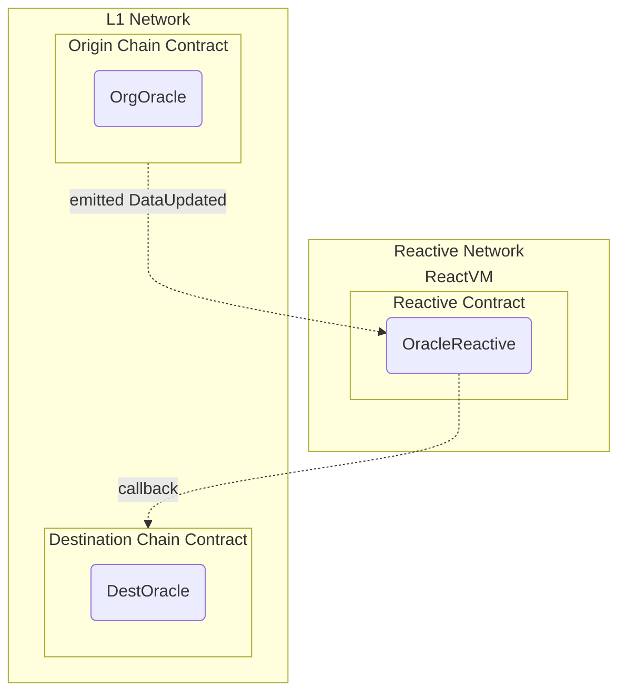

# Reactive Network Cross-Chain Governance

## Overview

This is a simple workflow demonstrating catching an update event from an Oracle on the original chain and update the destination oracle on the destination chain.
Key concepts:

- Low-latency monitoring of governance request events emitted by arbitrary contracts in the L1 Network (Sepolia testnet in this case).
- Calls from Reactive Network to L1 Governance contracts.



In practical terms, this general use case can be applicable in any number of scenarios, from simple stop orders to fully decentralized algorithmic trading.

There are three main contracts involved in this scenario:

- Origin chain contract.
- Reactive contract.
- Destination chain contract.

### Origin Chain Contract

This contract, or set of contracts, presumably emits logs of interest to the Reactive Network user. In financial applications, this could be a DEX, such as a Uniswap pool, emitting data on trades and/or exchange rates. Typically, the contract is controlled by a third party; otherwise, mediation by Reactive Network would be unnecessary.

Here, this contract is implemented in OrgOracle.sol. Its functionality is to store the oracle data and emit the corresponding events on update.

## Reactive Contract

Reactive contracts implement the logic of event monitoring and initiating calls back to L1 chains. These contracts are fully-fledged EVM contracts with the ability to maintain state persistence, subscribe/unsubscribe to multiple event origins, and perform callbacks. This can be done both statically and dynamically by emitting specialized log records, which specify the parameters of a transaction to be submitted to the destination chain.

Reactive contracts are executed in a private subnet (ReactVM) tied to a specific deployer address. This limitation enhances their ability to scale, although it restricts their interaction with other reactive contracts.

In our demo, the reactive contract implemented in OracleReactive.sol subscribes to update events emitted by OrgOracle.sol upon deployment. Whenever the observed contract reports a governance decision requiring execution, the reactive contract initiates an authorized L1 callback by emitting a log record with the necessary transaction parameters and payload to ensure proper execution on the destination network.

## Destination Chain Contract

The DestOracle.sol is the L1 part of the governance logic. The governance contract listens to the update events and call the update function on the destination network.

## Deployment

### Prerequisites

Ensure you have the following environment variables set up:

```
export SEPOLIA_RPC="<YOUR_SEPOLIA_RPC_URL>"
export SEPOLIA_PRIVATE_KEY="<YOUR_SEPOLIA_PRIVATE_KEY>"
export REACTIVE_RPC="<YOUR_REACTIVE_RPC_URL>"
export REACTIVE_PRIVATE_KEY="<YOUR_REACTIVE_PRIVATE_KEY>"
export SYSTEM_CONTRACT_ADDR="<YOUR_SYSTEM_CONTRACT_ADDR>"
```

### Deploy the Contracts

First, deploy the origin contract to Sepolia:

```
forge create --rpc-url $SEPOLIA_RPC --private-key $SEPOLIA_PRIVATE_KEY src/demos/cross-chain-oracle/OrgOracle.sol:OrgOracle # deployed to 0xd92fFA356a77037623c5777E52C73331add72627
```

Assign the deployment address to the environment variable ORIGIN_ADDR.

Now deploy the destination contract to Sepolia (Here, the AUTHORIZED_CALLER_ADDRESS should contain the address you intend to authorize for performing callbacks or use 0x0000000000000000000000000000000000000000 to skip this check):

```
forge create --rpc-url $SEPOLIA_RPC --private-key $SEPOLIA_PRIVATE_KEY src/demos/cross-chain-oracle/DestOracle.sol:DestOracle --constructor-args $AUTHORIZED_CALLER_ADDRESS # deployed to 0xdBbC231a98D30a71311295b79AA2c4833878567D
```

Assign the deployment address to the environment variable `CALLBACK_ADDR`.

Finally, deploy the reactive contract, configuring it to send callbacks
to `CALLBACK_ADDR`.

```
forge create --rpc-url $REACTIVE_RPC --private-key $REACTIVE_PRIVATE_KEY src/demos/cross-chain-oracle/OracleReactive.sol:OracleReactive --constructor-args $SYSTEM_CONTRACT_ADDR $CALLBACK_ADDR # deployed at 0xc6F237C2ED2434aF698CeE205A2C158E9E118B77
```

## Testing the workflow

Test the whole setup by emitting an DataUpdated event from the origin chain:

```
cast send $ORIGIN_ADDR 'updateData(uint256)' --rpc-url $SEPOLIA_RPC --private-key $SEPOLIA_PRIVATE_KEY 5000000000000000 # sample tx: 0xb31a3028e52af741220cb150bf144a17d16138581cdecf3c9b078236a970a283 , callback tx: 0x64f9d5990472658d698970173727f75ea7664cdc164d662cfc81911d4974ea03
```

After a few moments, the ReactVM calls on the callback contract, and we will have the updated data on the destination oracle:

```
cast call $CALLBACK_ADDR 'getData()' --rpc-url $SEPOLIA_RPC --private-key $SEPOLIA_PRIVATE_KEY
```
